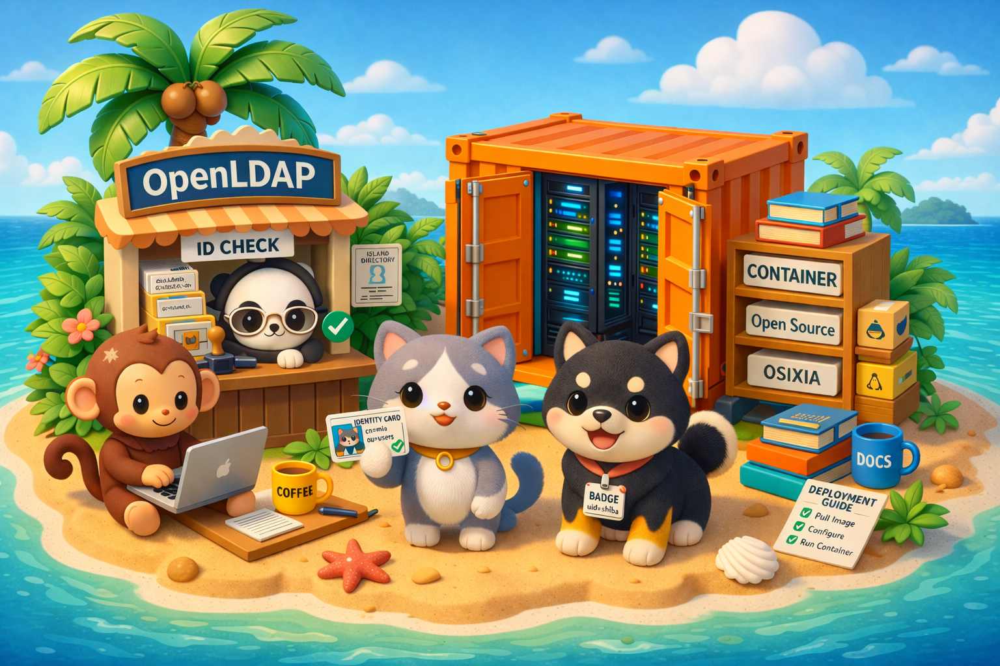

# osixia/openldap 🐳🪪🌴

[docker hub]: https://hub.docker.com/r/osixia/openldap
[github]: https://github.com/osixia/container-openldap

[][docker hub]
[][docker hub]
[][github]
[](https://github.com/osixia/container-openldap/graphs/contributors)

[OpenLDAP](https://www.openldap.org/) container image with built-in bootstrap, TLS, replication, backup helpers, and upgrade support.

110M+ pulls 🎉 Thanks to everyone using, testing, reporting issues, and contributing to this image. 🙏

> ⚠️ WARNING
> **v2 is a breaking release.** Existing v1 deployments are **not** migrated automatically and require a **manual migration** to move to v2.
> Automatic upgrade paths are intended only between future v2 versions (for example, v2.x to v2.y).



- [osixia/openldap 🐳🪪🌴](#osixiaopenldap-)
  - [⚡ Quickstart](#-quickstart)
  - [📊 Data Management](#-data-management)
    - [Backup / Restore](#backup--restore)
    - [Replication](#replication)
  - [🔒 Security](#-security)
    - [Password Helpers](#password-helpers)
    - [TLS](#tls)
  - [🛠️ LDAP Toolkit](#️-ldap-toolkit)
    - [OpenLDAP Utilities](#openldap-utilities)
    - [Convert Schema to LDIF](#convert-schema-to-ldif)
  - [🔤 Environment Variables](#-environment-variables)
  - [📄 Documentation](#-documentation)
  - [🔀 Contributing](#-contributing)
  - [🔓 License](#-license)


## ⚡ Quickstart

Run a basic OpenLDAP server:

```bash
docker run --name openldap --hostname ldap.example.org -p 389:3890 -p 636:6360 \
  -e OPENLDAP_BOOTSTRAP_ORGANIZATION="Keycloakers Org" \
  -e OPENLDAP_BOOTSTRAP_SUFFIX="dc=keycloakers,dc=org" \
  osixia/openldap
```

For persistent deployments, mount config, data, and backup directories:

```bash
docker run --name openldap --hostname ldap.example.org -p 389:3890 -p 636:6360 \
  -e OPENLDAP_BOOTSTRAP_ORGANIZATION="Keycloakers Org" \
  -e OPENLDAP_BOOTSTRAP_SUFFIX="dc=keycloakers,dc=org" \
  -v openldap-conf:/etc/openldap/slapd.d \
  -v openldap-data:/var/lib/openldap/openldap-data \
  -v openldap-backups:/var/lib/openldap/openldap-backups \
  osixia/openldap
```

Notes:
- Internal container ports are `3890` (LDAP) and `6360` (LDAPS).
- On first start, passwords are generated if hashed values are empty and printed in logs.
- Bootstrap runs only when config/data are empty.

**Passing command-line arguments to OpenLDAP**

The `osixia/openldap` container allows you to pass additional command-line arguments directly to the OpenLDAP binary.

Arguments specified after `--` are forwarded to the slapd process inside the container:

``` bash
docker run osixia/openldap -- -d -1
```

**Debugging**

To debug the container manually, you can start it with an interactive shell.

The `--debug` option from `osixia/baseimage` enables debug logging, installs debugging tools, and launches an interactive shell.

If OpenLDAP keeps crashing, you can add `--skip-process` to start the container without launching service processes.

``` bash
docker run -it osixia/openldap --debug
docker run -it osixia/openldap --skip-process --debug 
```

You can also increase OpenLDAP logs level:
``` bash
docker run -e OPENLDAP_DEBUG_LEVEL=-1 osixia/openldap
docker run osixia/openldap -d -1
```

To see all available command-line options:
``` bash
docker run --rm osixia/openldap --help # osixia/baseimage options
docker run --rm osixia/openldap -x openldap -- --help # slapd command-line options
```


## 📊 Data Management

### Backup / Restore

The image includes the `openldap-ctl` helper with `backup` and `restore` commands.

Create a full backup:

```bash
docker exec openldap openldap-ctl backup my-backup
```

Create only a data backup and remove files older than 15 days:

```bash
docker exec openldap openldap-ctl backup my-backup --data --clean 15
```

This creates files in `OPENLDAP_BACKUP_DIR`:

- `my-backup-config.gz`
- `my-backup-data.gz`

Restore a backup:

``` bash
docker exec openldap openldap-ctl restore my-backup --force
```

`restore --force` stops the OpenLDAP process if needed, deletes existing data in the target directories, restores the selected databases, then starts OpenLDAP again.

You can also run a cron service to automatically perform regular backups:

``` bash
docker run --name openldap-cron \
  -u root \
  -v openldap-conf:/etc/openldap/slapd.d \
  -v openldap-data:/var/lib/openldap/openldap-data \
  -v openldap-backups:/var/lib/openldap/openldap-backups \
  osixia/openldap -x openldap-cron
```

See the `OPENLDAP_CRON_JOB` environment variable to adjust the cron schedule and behavior.

### Replication

Set `OPENLDAP_BOOTSTRAP_REPLICATION=true` to bootstrap syncrepl replication.

`OPENLDAP_BOOTSTRAP_REPLICATION_HOSTS` must contain exactly two hosts, in the same order on both servers. The current node FQDN must match one of them.

For a local Docker setup, put both containers on the same user-defined network so each host can resolve the other one:

```bash
docker network create openldap-net
```

Minimal example for `ldap1.example.org`:

```bash
docker run --name ldap1 --network openldap-net --hostname ldap1.example.org \
  -p 389:3890 -p 636:6360 \
  -e OPENLDAP_BOOTSTRAP_ORGANIZATION="Keycloakers Org" \
  -e OPENLDAP_BOOTSTRAP_SUFFIX="dc=keycloakers,dc=org" \
  -e OPENLDAP_BOOTSTRAP_REPLICATION=true \
  -e OPENLDAP_BOOTSTRAP_REPLICATION_HOSTS="ldap://ldap1.example.org:3890 ldap://ldap2.example.org:3890" \
  -e OPENLDAP_BOOTSTRAP_REPLICATION_CONFIG_READONLY_PASSWORD="passw0rd" \
  -e OPENLDAP_BOOTSTRAP_REPLICATION_DATA_READONLY_PASSWORD="passw0rd" \
  osixia/openldap
```

Minimal example for `ldap2.example.org`:

```bash
docker run --name ldap2 --network openldap-net --hostname ldap2.example.org \
  -p 1389:3890 -p 1636:6360 \
  -e OPENLDAP_BOOTSTRAP_ORGANIZATION="Keycloakers Org" \
  -e OPENLDAP_BOOTSTRAP_SUFFIX="dc=keycloakers,dc=org" \
  -e OPENLDAP_BOOTSTRAP_REPLICATION=true \
  -e OPENLDAP_BOOTSTRAP_REPLICATION_HOSTS="ldap://ldap1.example.org:3890 ldap://ldap2.example.org:3890" \
  -e OPENLDAP_BOOTSTRAP_REPLICATION_CONFIG_READONLY_PASSWORD="passw0rd" \
  -e OPENLDAP_BOOTSTRAP_REPLICATION_DATA_READONLY_PASSWORD="passw0rd" \
  osixia/openldap
```

If TLS is required for replication, set `OPENLDAP_BOOTSTRAP_REPLICATION_TLS=true` or rely on its default value from `OPENLDAP_BOOTSTRAP_TLS_REQUIRED`.

## 🔒 Security

### Password Helpers

Generate a random password:

``` bash
docker run --rm osixia/openldap --cmd -- openldap-ctl password generate
```

Hash a password:

``` bash
docker run --rm osixia/openldap --cmd -- openldap-ctl password hash passw0rd
```

### TLS

Set `OPENLDAP_BOOTSTRAP_TLS=true` to configure TLS during bootstrap.

The default certificate paths are:

- `/container/services/openldap/assets/certs/cert.crt`
- `/container/services/openldap/assets/certs/cert.key`
- `/container/services/openldap/assets/certs/ca.crt`

The simplest way is to mount a directory that contains files with exactly those names:

```bash
docker run --name openldap --hostname ldap.example.org -p 389:3890 -p 636:6360 \
  -e OPENLDAP_BOOTSTRAP_TLS=true \
  -v $PWD/certs:/container/services/openldap/assets/certs \
  osixia/openldap
```

If you also set `OPENLDAP_BOOTSTRAP_TLS_REQUIRED=true`, bootstrap adds TLS-required access rules. That setting is stricter than plain TLS enablement and is intended for deployments where non-TLS client access should be rejected.

## 🛠️ LDAP Toolkit

### OpenLDAP Utilities

This image ships with OpenLDAP client utilities, enabling direct use of commands like `ldapsearch`, `ldapwhoami`, `ldapadd`, `ldapmodify`, `ldapdelete`, and `ldappasswd`.

``` bash
docker run --rm osixia/openldap --cmd -- ldapsearch -h 172.16.0.1
```

### Convert Schema to LDIF

``` bash
docker run --rm -v schema:/data
  osixia/openldap --cmd -- openldap-ctl schema2ldif /data/test.schema
```

## 🔤 Environment Variables

**Core**

| Variable                      | Description                                           | Default                                      |
| ----------------------------- | ----------------------------------------------------- | -------------------------------------------- |
| `OPENLDAP_CONF_DIR`           | OpenLDAP configuration directory (`slapd.d`)          | `/etc/openldap/slapd.d`                      |
| `OPENLDAP_DATA_DIR`           | OpenLDAP data directory                               | `/var/lib/openldap/openldap-data`            |
| `OPENLDAP_BACKUP_DIR`         | Backup directory used by `openldap-ctl backup`        | `/var/lib/openldap/openldap-backups`         |
| `OPENLDAP_MODULES_DIR`        | Directory used by OpenLDAP dynamic modules            | `/usr/lib/openldap`                          |
| `OPENLDAP_SCHEMAS_DIR`        | Directory containing LDIF schemas loaded at bootstrap | `/etc/openldap/schema`                       |
| `OPENLDAP_CUSTOM_MODULES_DIR` | Custom modules copied at startup                      | `/container/services/openldap/assets/module` |
| `OPENLDAP_CUSTOM_SCHEMAS_DIR` | Custom schemas copied at startup                      | `/container/services/openldap/assets/schema` |
| `OPENLDAP_NOFILE`             | `ulimit -n` value before starting `slapd`             | `65536`                                      |
| `OPENLDAP_DEBUG_LEVEL`        | Default `slapd` debug level                           | `256`                                        |

**Bootstrap**

| Variable                                              | Description                                                                       | Default                                                     |
| ----------------------------------------------------- | --------------------------------------------------------------------------------- | ----------------------------------------------------------- |
| `OPENLDAP_BOOTSTRAP_ORGANIZATION`                     | Organization name used in bootstrap data                                          | `Example Org`                                               |
| `OPENLDAP_BOOTSTRAP_SUFFIX`                           | Base LDAP suffix                                                                  | `dc=example,dc=org`                                         |
| `OPENLDAP_BOOTSTRAP_MODULES`                          | OpenLDAP modules loaded during bootstrap                                          | `back_mdb.so argon2.so ppolicy.so refint.so syncprov.so`    |
| `OPENLDAP_BOOTSTRAP_SCHEMAS`                          | LDIF schemas imported during bootstrap                                            | `core.ldif cosine.ldif inetorgperson.ldif rfc2307bis.ldif`  |
| `OPENLDAP_BOOTSTRAP_CONFIG_ROOT_DN`                   | Root DN for `cn=config`                                                           | `cn=admin,cn=config`                                        |
| `OPENLDAP_BOOTSTRAP_CONFIG_ROOT_PASSWORD_HASHED`      | Hashed password for `cn=config`; generated if empty                               | ``                                                          |
| `OPENLDAP_BOOTSTRAP_DATA_DATABASE_MAX_SIZE`           | MDB max size for main database                                                    | `1073741824`                                                |
| `OPENLDAP_BOOTSTRAP_DATA_ROOT_DN`                     | Root DN for main database                                                         | `cn=admin,${OPENLDAP_BOOTSTRAP_SUFFIX}`                     |
| `OPENLDAP_BOOTSTRAP_DATA_ROOT_PASSWORD_HASHED`        | Hashed password for main database root DN; generated if empty                     | ``                                                          |
| `OPENLDAP_BOOTSTRAP_DATA_READONLY`                    | Enable read-only data account creation                                            | `false`                                                     |
| `OPENLDAP_BOOTSTRAP_DATA_READONLY_DN`                 | DN of the read-only data account                                                  | `cn=readonly,${OPENLDAP_BOOTSTRAP_SUFFIX}`                  |
| `OPENLDAP_BOOTSTRAP_DATA_READONLY_PASSWORD_HASHED`    | Hashed password of the read-only data account; generated if empty when enabled    | ``                                                          |
| `OPENLDAP_BOOTSTRAP_MONITOR_ENABLED`                  | Enable monitor backend                                                            | `false`                                                     |
| `OPENLDAP_BOOTSTRAP_MONITOR_READONLY`                 | Enable read-only monitor account creation                                         | `false`                                                     |
| `OPENLDAP_BOOTSTRAP_MONITOR_READONLY_DN`              | DN of the read-only monitor account                                               | `cn=readonly-monitor,${OPENLDAP_BOOTSTRAP_SUFFIX}`          |
| `OPENLDAP_BOOTSTRAP_MONITOR_READONLY_PASSWORD_HASHED` | Hashed password of the read-only monitor account; generated if empty when enabled | ``                                                          |
| `OPENLDAP_BOOTSTRAP_LDIF_CONFIG_DIR`                  | Source directory for config LDIF bootstrap files                                  | `/container/services/openldap-bootstrap/assets/ldif/config` |
| `OPENLDAP_BOOTSTRAP_LDIF_DATA_DIR`                    | Source directory for data LDIF bootstrap files                                    | `/container/services/openldap-bootstrap/assets/ldif/data`   |
| `OPENLDAP_BOOTSTRAP_SCRIPTS_DIR`                      | Source directory for bootstrap scripts                                            | `/container/services/openldap-bootstrap/assets/scripts`     |

**TLS**

| Variable                               | Description                                    | Default                                              |
| -------------------------------------- | ---------------------------------------------- | ---------------------------------------------------- |
| `OPENLDAP_BOOTSTRAP_TLS`               | Enable TLS configuration during bootstrap      | `false`                                              |
| `OPENLDAP_BOOTSTRAP_TLS_CERT`          | Server certificate path                        | `/container/services/openldap/assets/certs/cert.crt` |
| `OPENLDAP_BOOTSTRAP_TLS_CERT_KEY`      | Server private key path                        | `/container/services/openldap/assets/certs/cert.key` |
| `OPENLDAP_BOOTSTRAP_TLS_CA_CERT`       | CA certificate path                            | `/container/services/openldap/assets/certs/ca.crt`   |
| `OPENLDAP_BOOTSTRAP_TLS_VERIFY_CLIENT` | Value for `olcTLSVerifyClient`                 | `allow`                                              |
| `OPENLDAP_BOOTSTRAP_TLS_PROTOCOL_MIN`  | Value for `olcTLSProtocolMin`                  | `3.3`                                                |
| `OPENLDAP_BOOTSTRAP_TLS_REQUIRED`      | Enforce TLS-only access rules during bootstrap | `false`                                              |

**Replication**

| Variable                                                   | Description                                                                | Default                                                               |
| ---------------------------------------------------------- | -------------------------------------------------------------------------- | --------------------------------------------------------------------- |
| `OPENLDAP_BOOTSTRAP_REPLICATION`                           | Enable replication bootstrap                                               | `false`                                                               |
| `OPENLDAP_BOOTSTRAP_REPLICATION_HOSTS`                     | Two replication endpoints, same order on both servers                      | `ldap://ldap1.example.org:3890 ldap://ldap2.example.org:3890`         |
| `OPENLDAP_BOOTSTRAP_REPLICATION_SYNCPROV_CHECKPOINT`       | `syncprov` checkpoint configuration                                        | `100 10`                                                              |
| `OPENLDAP_BOOTSTRAP_REPLICATION_CONFIG_READONLY_DN`        | Replication account DN for `cn=config`                                     | `cn=config-replicator,${OPENLDAP_BOOTSTRAP_SUFFIX}`                   |
| `OPENLDAP_BOOTSTRAP_REPLICATION_CONFIG_READONLY_PASSWORD`  | Plain password for the `cn=config` replication account; generated if empty | ``                                                                    |
| `OPENLDAP_BOOTSTRAP_REPLICATION_CONFIG_SYNC_REPL_TEMPLATE` | Template used to generate config `olcSyncRepl`                             | `rid=\${OPENLDAP_BOOTSTRAP_REPLICATION_CONFIG_SYNC_REPL_RID} ...`     |
| `OPENLDAP_BOOTSTRAP_REPLICATION_CONFIG_LIMITS`             | Limits ACL for the config replication account                              | `dn.exact="${OPENLDAP_BOOTSTRAP_REPLICATION_CONFIG_READONLY_DN}" ...` |
| `OPENLDAP_BOOTSTRAP_REPLICATION_DATA_READONLY_DN`          | Replication account DN for the main database                               | `cn=data-replicator,${OPENLDAP_BOOTSTRAP_SUFFIX}`                     |
| `OPENLDAP_BOOTSTRAP_REPLICATION_DATA_READONLY_PASSWORD`    | Plain password for the data replication account; generated if empty        | ``                                                                    |
| `OPENLDAP_BOOTSTRAP_REPLICATION_DATA_SYNC_REPL_TEMPLATE`   | Template used to generate data `olcSyncRepl`                               | `rid=\${OPENLDAP_BOOTSTRAP_REPLICATION_DATA_SYNC_REPL_RID} ...`       |
| `OPENLDAP_BOOTSTRAP_REPLICATION_DATA_LIMITS`               | Limits ACL for the data replication account                                | `dn.exact="${OPENLDAP_BOOTSTRAP_REPLICATION_DATA_READONLY_DN}" ...`   |
| `OPENLDAP_BOOTSTRAP_REPLICATION_TLS`                       | Enable TLS settings in generated replication config                        | `${OPENLDAP_BOOTSTRAP_TLS_REQUIRED}`                                  |
| `OPENLDAP_BOOTSTRAP_REPLICATION_TLS_SYNC_REPL`             | Extra `syncrepl` TLS options                                               | `starttls=critical tls_reqcert=demand`                                |

**Helpers and Maintenance**

| Variable                                 | Description                                                 | Default                                                                                                                                                                    |
| ---------------------------------------- | ----------------------------------------------------------- | -------------------------------------------------------------------------------------------------------------------------------------------------------------------------- |
| `OPENLDAP_CTL_BACKUP_CONFIG_FILE_SUFFIX` | Suffix used for config backups                              | `-config.gz`                                                                                                                                                               |
| `OPENLDAP_CTL_BACKUP_DATA_FILE_SUFFIX`   | Suffix used for data backups                                | `-data.gz`                                                                                                                                                                 |
| `OPENLDAP_CTL_PASSWORD_GENERATE_CMD`     | Command used by `openldap-ctl password generate`            | `slappasswd -n -g; slappasswd -g`                                                                                                                                          |
| `OPENLDAP_CTL_PASSWORD_HASH_CMD`         | Command used by `openldap-ctl password hash`                | `slappasswd -h {ARGON2} -o module-path=${OPENLDAP_MODULES_DIR} -o module-load=argon2`                                                                                      |
| `OPENLDAP_CTL_SCHEMA2LDIF_DEPENDENCIES`  | Default schema dependencies for `schema2ldif`               | `core.schema cosine.schema inetorgperson.schema`                                                                                                                           |
| `OPENLDAP_CRON_JOB`                      | Cron job used by the backup service                         | `15 2 * * * PATH=${PATH} source /run/container/environment.sh && openldap-ctl backup "$(date -I)-${OPENLDAP_VERSION}-openldap-cron" --clean 15` |
| `OPENLDAP_UPGRADE_FORCE`                 | Allow upgrade bypasses, including forced downgrade handling | `false`                                                                                                                                                                    |
| `OPENLDAP_UPGRADE_MIGRATION_LEVEL`       | Allowed migration level                                     | `minor`                                                                                                                                                                    |
| `OPENLDAP_UPGRADE_BACKUP_FILES_PREFIX`   | Prefix for upgrade backup files                             | `openldap-upgrade`                                                                                                                                                         |
| `OPENLDAP_UPGRADE_CONF_VERSION_FILE`     | File storing the current config version                     | `${OPENLDAP_CONF_DIR}/.version`                                                                                                                                            |

## 📄 Documentation

See full documentation and complete features list on [osixia/openldap documentation](https://opensource.osixia.net/projects/container-images/openldap/).

This image is based on [osixia/baseimage](https://github.com/osixia/container-baseimage)

## 🔀 Contributing

If you find this project useful here's how you can help:

- Send a pull request with new features and bug fixes.
- Help new users with [issues](https://github.com/osixia/container-openldap/issues) they may encounter.
- Support the development of this image and star [this repo][github] and the image [docker hub repository][docker hub].

This project use [dagger](https://github.com/dagger/dagger) as CI/CD tool to build, test and deploy images. See source code and usefull command lines in [build directory](build/).

## 🔓 License

This project is licensed under the terms of the MIT license. See [LICENSE.md](LICENSE.md) file for more information.
